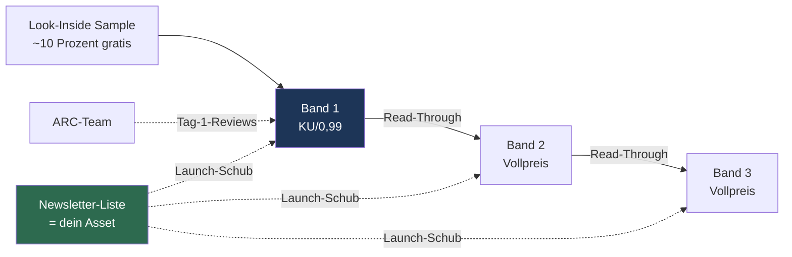

# Launch-Strategie — Uncommon Courtesy (Weg A: Rapid Release)

> Stand: 17. Juni 2026. Gewählter Weg: **A — Rapid Release in KU** (Autor-Entscheid).
> Konvention wie `Serie_und_Titel.md`: Nur Empfohlenes/Entschiedenes; alles, was der Autor noch festlegen muss, ist mit `[ENTSCHEIDEN]` markiert. Keine erfundenen ISBNs/Preise/Daten als „fix" — Daten sind als *Annahme* gekennzeichnet.

---

## 0. TL;DR

- **Nicht der einzelne Launch zählt, sondern die Serien-Sequenz.** Wir bauen Band 1 nicht als Solo-Start, sondern als ersten Dominostein.
- **Fundament wird JETZT gebaut** (Cover, Blurb, Newsletter, ARC-Team, Kategorien) — parallel zum Schreiben von Band 2. Diese Phase entscheidet den Großteil des Erfolgs, nicht der Launch-Tag.
- **Launch erst, wenn Band 2 fertig + editiert ist und Band 3 in Arbeit.** Dann Band 1 → Band 2 im Abstand von **4–6 Wochen** veröffentlichen.
- **KU/KDP Select** (digitale Exklusivität) liefert den „Reinschnupper"-Effekt eingebaut (Look-Inside-Sample + KU-Abonnenten lesen risikolos). Kein RoyalRoad nötig.
- **Permafree (Band 1 gratis) ist das Endspiel** — sinnvoll erst ab Band 3 live. Vorher Preis-Taktik über 0,99 → Vollpreis.

---

## 1. Warum Weg A (Rapid Release)

Für einen unbekannten Autor in einem schwer einsortierbaren Genre ist der härteste Hebel **nicht** Reichweite am Launch-Tag, sondern die **schnelle Aufeinanderfolge mehrerer Bände**:

1. **Sichtbarkeits-Fenster stapeln.** Amazon begünstigt neue Titel in den ersten ~30 Tagen (New-Release-/Hot-New-Releases-Listen, Algorithmus-Gewichtung). Drei Starts in kurzen Abständen = drei sich überlappende Fenster, die sich gegenseitig anschieben.
2. **Also-Boughts verketten.** Käufer von Band 1 sehen sofort Band 2/3. Der Algorithmus lernt die Serie als Einheit.
3. **Read-Through.** Der eigentliche Gewinn in KU ist nicht Band 1, sondern wie viele von Band 1 zu Band 2/3 weiterlesen. Dafür müssen die Folgebände *existieren und kaufbar sein*.
4. **Der Permafree-Funnel** (Band 1 gratis) zündet nur mit ≥ 2–3 Bänden dahinter.

**Konsequenz:** Band 1 wird zurückgehalten, bis genug Serie dahintersteht. Die Wartezeit ist kein Verlust — sie ist Bauzeit fürs Fundament.

---

## 2. Die Grundlogik in einem Bild

Zwei Dinge gehören **dir** (nicht Amazon) und tragen jeden künftigen Launch: die **Newsletter-Liste** und das **ARC-/Review-Team**. Beide werden ab sofort aufgebaut.

---

## 3. Zeitplan (Annahme — anpassen)

**Annahmen** (vom Autor bestätigt/zu bestätigen):
- Band 1: Manuskript komplett. ✔
- Band 2: ~2–2,5 Monate netto Schreibzeit (1–1,5 Monate reine Arbeit + Urlaubswoche + erhöhte Joblast). → Manuskript-Ziel **[ENTSCHEIDEN: ca. Ende Aug / Mitte Sep 2026]**.
- Band 3: Schreibstart direkt nach Band-2-Rohfassung.

| Zeitraum (Annahme) | Schreiben | Launch-Fundament |
|---|---|---|
| **Jun–Aug 2026** | Band 2 Rohfassung | Cover beauftragen, Blurb finalisieren, Newsletter + Lead-Magnet live, ARC-Team aufbauen, Kategorien/Keywords recherchieren |
| **Sep 2026** | Band 2 Edit/Korrektorat; Band 3 Start | Band 1 final formatieren (eBook + Print), Vorbestellung Band 1 aufsetzen, ARC-Kopien Band 1 raus |
| **Okt 2026** *(Launch-Monat, [ENTSCHEIDEN])* | Band 3 schreiben | **Launch Band 1** → ARC-Reviews, Newsletter-Mail, Amazon Ads klein starten |
| **Nov 2026** *(+4–6 Wo)* | Band 3 schreiben | **Launch Band 2** → hebt Band 1 mit |
| **ab Dez 2026** | Band 3 fertigstellen | **Launch Band 3** → danach: Band 1 **permafree** prüfen (Funnel scharfschalten) |

> ⚠️ **Disziplin-Risiko Weg A:** Wenn Band 3 nach Band 2 nicht zügig nachkommt, reißt der Funnel ab. Mindestziel vor dem Band-1-Launch: **Band 2 fertig + Band 3 mindestens zur Hälfte**. Notfalls 2er-Rapid (Band 1+2) und Band 3 als Sustain — schwächer, aber gangbar.

---

## 4. Phase 0 — Fundament (JETZT, parallel zum Schreiben)

> Diese Phase entscheidet ~80 %. Reihenfolge nach Hebel.

- [ ] **Cover (eBook + Print).** Profi-Designer. Genre-Signal „cozy menace / suburban suspense mit Humor". Briefing: siehe separates Cover-Briefing (Chat / ggf. eigene Datei). Vor allem: erste 1 Sekunde muss das *richtige* Regal signalisieren.
- [ ] **Blurb final.** Hook = Kontrast Höflichkeit ↔ Gefahr. Entwurf liegt vor (Chat). A/B-fähig für Ads.
- [ ] **Positionierung / Comps festziehen** (Käufer-Comps, nicht nur DNA — s. Abschnitt 11 unten + Chat).
- [ ] **Newsletter + Lead-Magnet.** Mailanbieter [ENTSCHEIDEN: z. B. MailerLite (kostenlos bis ~1.000) / EmailOctopus]. Lead-Magnet-Idee: **der Prolog** (Aldrics interner POV) oder eine exklusive Bonus-Szene gegen E-Mail. Landingpage simpel.
- [ ] **ARC-/Review-Team aufbauen.** Ziel: 15–30 Leser, die am Launch-Tag ehrlich reviewen. Quellen: Genre-Gruppen (FB/Reddit r/suggestmeabook-Umfeld, Booksprout/StoryOrigin), wachsende Newsletter-Liste.
- [ ] **Bestehende RoyalRoad-Leserschaft als Launch-Seed nutzen** (OHNE Maple Lane auf RR zu stellen): Autorenprofil + Autorennotizen der laufenden 7-teiligen Serie *Until The End* auf das KU-Buch + Newsletter verweisen. ⚠️ **Wichtig: kein Genre-Transfer.** *Until The End* = **Xianxia-basierte, dark-toned Progression Fantasy** — anderes Genre, anderer Store, anderes Format als Maple Lane (suburban-realistisch, kein Progression-Wrapper). Übertragbar ist NICHT das Genre, sondern (a) der **Autor-/Sensibilitäts-Follow** (dark-toned, character-driven, *tired-OP-Protagonist-der-Ruhe-will* — der MC von *Until The End* will, dass es endlich aufhört; Aldric will ein normales Leben: derselbe thematische Faden) und (b) Leser, die **dem Autor** folgen, nicht der Cultivation-Mechanik. Realistisch springt ein **Bruchteil** mit → warmer Seed, **kein** genre-passendes Massenpublikum.
- [ ] **Kategorien & Keywords festlegen.** Konkrete Auswahl je Format (3 Kategorien eBook + Print getrennt, 7 Keywords, Begründung, Backups & Policy-Regeln) in `Keywords_Kategorien.md`. Kern: **Suburban + Small Town & Rural + Crime**; Action-lastige Kategorien bewusst meiden (slow burn).
- [ ] **Editorial-Politur der ersten 10 %.** Das ist das Look-Inside-Sample = der „Prosa-muss-halten"-Test. Gnadenlos sauber.

---

## 5. Phase 1 — Pre-Launch (4–6 Wochen vor Tag X)

- [ ] **eBook + Print formatieren** (Tool [ENTSCHEIDEN: Vellum (Mac) / Atticus / Calibre]).
- [ ] **Vorbestellung Band 1** aufsetzen (sammelt Frühkäufe auf den Launch-Tag → Rank-Spike). KU-Titel können auf Pre-Order.
- [ ] **ARC-Kopien verteilen** (4–6 Wochen Vorlauf zum Lesen).
- [ ] **Launch-Mail vorbereiten** (Newsletter).
- [ ] **Backmatter setzen:** letzte Seite = höfliche Review-Bitte + Newsletter-Link + „Band 2 erscheint am …". Passt thematisch zu „Uncommon Courtesy".
- [ ] **Amazon-Autorenseite / Author Central** anlegen.

---

## 6. Phase 2 — Launch Band 1 (Woche 0)

- [ ] **In KDP Select** einschreiben (90-Tage-Exklusivität, KU aktiv).
- [ ] **Preis:** Start **0,99 USD/EUR** (Impuls + Rank-Aufbau), nach 1–2 Wochen hoch auf **[ENTSCHEIDEN: 3,99 / 4,99]** (70%-Royalty-Zone = 2,99–9,99).
- [ ] **Tag 1–3:** ARC-Reviews einsammeln (Ziel: 5–15 sichtbar), Newsletter-Mail raus, in Genre-Communities ankündigen (ohne Spam-Ton).
- [ ] **Free-Days NICHT** in Woche 1 verbrennen — später gezielt.
- [ ] **Print** parallel live (Glaubwürdigkeit + Zweiteinnahme).

---

## 7. Phase 3 — Sustain + Launch Band 2 (Woche 2 ff.)

- [ ] **Amazon Ads (AMS)** klein starten: auf Comp-Autoren/-Titel als Keywords bieten (s. Abschnitt 11). Skalieren, was profitabel ist; Rest killen.
- [ ] **Reviews weiter sammeln** (Backmatter + Newsletter).
- [ ] **Launch Band 2** im Abstand **4–6 Wochen** → hebt Band 1 (Also-Boughts, Serien-Seite).
- [ ] **Daten lesen** (Abschnitt 10): Sample→Kauf = zieht Cover/Blurb? KENP-Read-Through = hält die Prosa?

---

## 8. Phase 4 — Funnel / Permafree (ab Band 3 live)

- [ ] **Band 1 permafree** prüfen. In KU nicht direkt möglich (Min. 0,99). Wege:
  - Band 1 aus Select nehmen → **wide** gehen → über Price-Matching permafree (gratis auf anderen Stores → Amazon zieht nach), **oder**
  - in Select bleiben und Free-Days gezielt takten (schwächeres Permafree-Surrogat).
- [ ] **Trade-off bewusst entscheiden** (Abschnitt 11): Band-1-permafree-Funnel ↔ Verlust der KU-Reads auf Band 1.
- [ ] Folgebände bleiben Vollpreis in KU.

---

## 9. KU-Taktik — Details

| Hebel | Empfehlung | Notiz |
|---|---|---|
| **Exklusivität** | KDP Select, 90 Tage, Auto-Renewal zunächst AN | Für Rapid Release + KENP-Income korrekt |
| **Launch-Preis** | 0,99 | niedrige Schwelle, Rank-Aufbau (nur 35% Royalty — bewusst) |
| **Standardpreis** | [ENTSCHEIDEN] 3,99–4,99 | 70%-Zone (2,99–9,99) |
| **Free-Days** | 5 / 90 Tage, gezielt nach Woche 1 | zum Wiederanschieben / vor Band-2-Launch |
| **Countdown Deals** | Alternative zu Free-Days | behält Royalty bei reduziertem Preis |
| **Keywords (7 Slots)** | konkrete Suchphrasen statt Genre-Wörter | Voller Vorschlag + Regeln in `Keywords_Kategorien.md`. KEINE fremden Autorennamen in den Slots (Policy); Comp-Autoren nur für **Ads**. |
| **Kategorien** | **genau 3** (direkt im Setup) | ⚠️ Alter „Support für bis zu 10 Kategorien"-Trick ABGESCHAFFT — 3 ist die harte Grenze. Auswahl + Backups in `Keywords_Kategorien.md`. Nischen = leichter „#1 New Release"-Badge. |

---

## 10. KPIs / Was wir messen

| Metrik | Was sie verrät | Stellschraube |
|---|---|---|
| **Sample-Download → Kauf** | Ziehen Cover + Blurb? | Cover/Blurb/Preis |
| **KENP Read-Through (Seitenverlauf)** | „Hält die Prosa?" — sinkt die Leserate an einer Stelle, ist dort ein Problem | Text / Pacing |
| **Read-Through Band 1 → Band 2** | Funktioniert die Serie als Sog? | Cliffhanger/Backmatter |
| **Review-Rate & ⌀-Sterne** | richtige Zielgruppe erreicht? | Positionierung/Kategorien |
| **Ads: ACOS / Break-even** | skalierbar? | Keywords/Gebote |

> Der „Prosa-muss-halten"-Test des Autors = **KENP-Read-Through**. Das ist das saubere Messinstrument für genau diese Hypothese.

---

## 11. Positionierung & Comps (Marketing)

- **Zielleserschaft (präzisiert):** **Genre-Fiction-Leser, die Slice-of-Life mit kompetentem/„overpowered" Protagonisten lieben** („competent man" / „quiet OP protagonist"). NICHT die Cozy-Crime-/Book-Club-Leserschaft.
- **Was der RR-Track-Record belegt (und was nicht):** Belegt = **Schreibkompetenz** für den *tired-OP-SoL*-Stoff (dark-toned, character-driven; *Until The End*: >200k Views, 2 Mon. Top-10) + dass diese **Sensibilität** Publikum findet. NICHT belegt = dass das konkrete RR-Publikum die Maple-Lane-Zielgruppe ist (*Until The End* = **Xianxia Progression Fantasy**, anderes Genre). Die Comps unten kommen aus der **Buchanalyse**, nicht aus dem RR-Genre.
- **Interne DNA / Tagline-Würze:** „Mountie meets Punisher" — als *Seele*/augenzwinkernde Tagline, **nicht** als primäre Käufer-Comp (Mountie zu nischig, Punisher weckt reine Gun-Action-Erwartung; Buch ist 80 % ruhig).
- **Primäre Käufer-Comps (Kategorien, Ads, Blurb-Subtext):**
  - **Orphan X** (Hurwitz) — Profi mit striktem Regelcodex, hilft Menschen, lebt unauffällig. Nächste Entsprechung zu Aldric.
  - **The Old Man** (Perry) — pensionierter Profi, ruhiges Leben, tödlich wenn nötig.
  - **Jack Reacher** (Child) — kompetenter Mann löst Probleme; KU-Genre-Zugpferd fürs Ad-Targeting.
  - **Barry** (HBO) / **Gran Torino** — Killer-will-Ruhe-Dark-Comedy / gefährlicher Mann + Community.
  - **A Man Called Ove** (Backman) — Vorstadt-/Community-Wärme (Ton-Comp).
- **Sekundär (Cozy-Rand-Crossover):** **Dexter** (Killer mit Codex; Aldric = Dexter *mit* Code), **The Thursday Murder Club** (cozy + Ensemble) — nicht als Hauptanker.
- **Ad-Targeting:** Autoren/Serien der **primären** Comps als Keyword-Ziele.
- **Slow Burn = offensiv vermarkten (Genre-Tag, nicht Warnung):** „slow burn · character-driven · cozy menace" gehört in Blurb/Keywords/Kategorien/Ads. In dieser Leserschaft (vgl. Beware of Chickens, Heretical Fishing) ist „slow burn" ein KAUFARGUMENT, kein Warnschild. Ehrliches Erwartungs-Management = Zielgruppen-Filter.
- **⚠️ Erwartungs-Management:** Action-Dosis bewusst niedrig (80 % ruhig), Auflösung spät (slow burn). Comps + Blurb führen **Wärme + Kompetenz + brennende Lunte**, NICHT Action-Dichte — sonst Fehlkäufe + enttäuschte Reviews ("wo bleibt die Action?"). Der Hook ist das *Versprechen* (was unter der Oberfläche tickt), nicht Tempo.
- **Trade-off bewusst:** Slow Burn = kleineres, aber treueres Publikum mit höherem Read-Through — für Weg A (Serie/Funnel) die bessere Kurve (treue Leser kaufen Band 2/3 zuverlässiger als Impuls-Action-Käufer).
- **Permafree-Trade-off (Phase 4):** Band-1-gratis maximiert Funnel-Eintritt, kostet aber KU-Reads auf Band 1. Erst ab ≥ 3 Bänden rechnen.

---

## 12. Fallback — Weg B (Soft-Launch jetzt)

Falls der Serien-Vorlauf zu lange dauert oder ein Live-Test gewünscht ist:
- Band 1 sofort in KU, Erwartungen bewusst gedeckelt (Band 1 verpufft evtl. ohne „Weiter"-Ziel).
- Vorteil: echtes Leserfeedback + Lernkurve fürs Formatieren/Ads.
- Nachteil: kein gestapeltes Sichtbarkeits-Fenster, kein Funnel.
- **Hybrid (empfohlen, falls Ungeduld):** Band 1 jetzt *nicht* launchen, aber alles Fundament bauen **und** den Prolog/Bonus als Newsletter-Lead schon jetzt streuen → testet die Hook ohne den Erstband zu „verbrennen".

---

## 13. Offene Entscheidungen `[ENTSCHEIDEN]`

- [ ] Launch-Monat Band 1 (Vorschlag: Okt 2026).
- [ ] Anzahl fertiger Bände vor Launch (2 vs. 3).
- [ ] Standardpreis Folgebände (3,99 vs. 4,99).
- [ ] Mailanbieter + Lead-Magnet (Prolog vs. Bonus-Szene).
- [ ] Formatierungs-Tool (Vellum/Atticus/…).
- [ ] Permafree ja/nein ab Band 3 (KU-wide-Entscheidung).
- [ ] Print von Anfang an oder nachgelagert.
