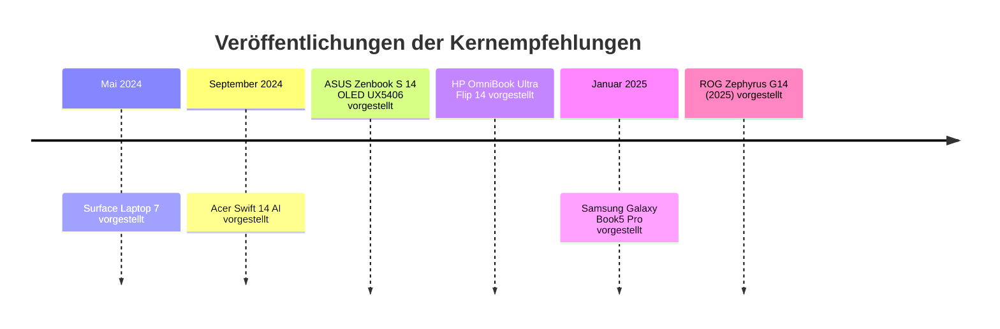

# Schicke Windows-Laptops für Deutschland 2026

## Executive Summary

Wenn ich für einen Käufer in Deutschland ohne feste Größen- oder Budgetgrenze **nur ein einziges Gesamtpaket** empfehlen müsste, wäre es das **ASUS Zenbook S 14 OLED UX5406**. Der Grund ist nicht nur das sehr schlanke und leichte 14-Zoll-Format von rund 1,18 kg bei 13 mm Bauhöhe, sondern die ungewöhnlich runde Kombination aus 2,8K/120-Hz-OLED mit fast voller P3-Abdeckung, leiser Kühlung im Alltagsmodus, sehr guter Laufzeit und praxisnäheren Anschlüssen als viele reine Designlaptops. Im deutschen Handel liegt es je nach Ausführung grob im Bereich **1.485 bis 1.700 Euro**, also klar Premium, aber noch nicht absurd teuer. citeturn4search0turn34view0turn10view0turn10view2turn35view0turn6search0

Wer **Design über alles** priorisiert, landet dennoch schnell beim **Surface Laptop 7 in 13,8 Zoll**: dünne Ränder, 3:2-Display, hochwertige Aluminiumhülle, starke Farboptionen und ein sehr helles 120-Hz-Panel sind ästhetisch derzeit kaum besser gelöst. Für deutsche Käufer ist aber die ARM-Plattform der zentrale Vorbehalt, weil ältere Treiber, Peripherie und einige Spezialprogramme nach wie vor problematisch sein können. Das **HP OmniBook Ultra Flip 14** ist die beste Premium-2-in-1-Wahl, das **Samsung Galaxy Book5 Pro 14** die eleganteste ultradünne OLED-Alternative mit für diese Klasse erfreulich guten Anschlüssen, das **ROG Zephyrus G14 (2025)** die klare Wahl für „Leistung mit Stil“, und das **Acer Swift 14 AI OLED** der überzeugendste Preis-/Style-Kompromiss. citeturn15view1turn36view0turn10view4turn37view1turn18view0turn38view0turn33view0turn33view1turn27view3turn30search4turn25view0turn25view1

## Bewertungsrahmen und Marktbild

Für diesen Bericht habe ich Modelle priorisiert, die in Deutschland **aktuell sichtbar im Handel** sind und deren Chassis oder relevante Refreshs seit **Mai 2024** eingeführt wurden; rein stilistisch starke, noch verfügbare Geräte bis zu rund 24 Monaten habe ich ausdrücklich mitgenommen. Bewertet wurden Designästhetik, Verarbeitungsqualität, Mobilität, Display, reale Praxisleistung, Laufzeit, Thermik/Lautstärke, Anschlussqualität, Kamera/Mikrofone, Eingabegeräte, Aufrüstbarkeit, Garantie sowie deutsche Straßenpreise und Händlerverfügbarkeit. Methodisch habe ich offizielle Herstellerdaten für Formfaktor, Spezifikationen und Farben mit Laborwerten von Notebookcheck für Display, Akku, Geräusche und Wärme kombiniert. citeturn4search1turn4search0turn4search2turn5search4turn5search5turn5search10

Auffällig ist, dass der deutsche Premium-„Style“-Markt 2026 klar von **14-Zoll-Geräten** dominiert wird: hier sitzen die elegantesten Metallgehäuse, die besten OLED-Panels und die niedrigsten Gewichte. Gleichzeitig werden die klassischen Kompromisse deutlicher: Fast alle schönen Geräte arbeiten mit **verlötetem RAM**, mehrere Modelle begrenzen die Aufrüstung auf SSD-Wechsel oder Zusatz-SSD, und Garantien/Services sind sehr ungleich verteilt. Besonders relevant für deutsche Käufer: **Microsoft** nennt auf der Consumer-Seite nur **1 Jahr Hardwaregarantie**, während **HP**, **Acer** und viele Händler-/Review-Spezifikationen für **ASUS**, **Samsung** und **ROG** typischerweise **24 Monate** ausweisen; **Lenovo** bündelt bei einzelnen Aura-SKUs sogar **2 Jahre Premium Care**, was im Servicevergleich ein echtes Differenzierungsmerkmal ist. Zudem ist die offizielle Verfügbarkeit nicht immer deckungsgleich mit dem Handel: Der Microsoft Store zeigt aktuelle 13,8-Zoll-Surface-Konfigurationen teils als „nicht vorrätig“, Acer listet bestimmte Swift-14-AI-SKUs im eigenen Store als ausverkauft, und beim ROG Zephyrus G14 sind manche deutschen Konfigurationen auf Geizhals/NBB nur sporadisch oder gar nicht sofort lieferbar. citeturn15view1turn38view6turn11view4turn34view5turn33view4turn28view4turn23view4turn39search1turn41search1turn41search3

## Vergleichstabelle der Empfehlungen

| Modell | Hersteller | Design-Highlights | Key Specs | Preisrange DE | Pros | Cons |
|---|---|---|---|---|---|---|
| urlZenbook S 14 OLED UX5406turn0search0 citeturn4search0turn34view0turn10view0turn10view2turn35view0turn6search0 | urlASUShttps://www.asus.com/de | sehr dünn, sehr leicht, dezentes Premium-Finish, schmale Ränder | 14", 2880×1800 OLED 120 Hz, Core Ultra 7 258V, 32 GB RAM, 1 TB SSD, 72 Wh, 1,18 kg | ca. **1.485–1.700 €** | bestes Gesamtpaket, leise, sehr gute Laufzeit, brauchbare Port-Auswahl | nur 381 Nits SDR, RAM verlötet, kurzer Tastenhub |
| urlSurface Laptop 13,8 Zollturn39search1 citeturn4search1turn15view1turn36view0turn10view4turn37view1turn23view6turn39search1 | urlMicrosofthttps://www.microsoft.com/de-de | eines der schönsten Industrie-Designs, 3:2, Farben, dünne Einfassungen, Aluminium | 13,8", 2304×1536 IPS 120 Hz, Snapdragon X Plus/Elite, 16–32 GB, 256 GB–1 TB SSD, 54 Wh, 1,34 kg | ca. **1.599–1.869 €** neu | extrem elegant, sehr helles Display, haptisches Touchpad, SSD wechselbar | ARM-Kompatibilität, wenige Ports, nur 1 Jahr Hardwaregarantie |
| urlHP OmniBook Ultra Flip 14turn21search0 citeturn4search2turn18view0turn18view2turn10view7turn38view0turn38view6turn21search0 | urlHPhttps://www.hp.com/de-de | edles Metall-Convertible, sehr schlank, Touch und Pen-Fokus | 14", 2880×1800 OLED Touch 120 Hz, Core Ultra 7 256V/258V, 16–32 GB, 1–2 TB SSD, 64 Wh, ~1,34 kg | ca. **1.599–2.099 €** | bestes 2-in-1 im Feld, starke Webcam, gute Laufzeit, 2 Jahre Garantie | portseitig nur USB-C/Thunderbolt, Touchpad nur mittel, draußen nicht sehr hell |
| urlSamsung Galaxy Book5 Pro 14turn13view4 citeturn5search5turn19view0turn19view1turn20view0turn33view0turn33view1turn33view5 | urlSamsunghttps://www.samsung.com/de | ultraflach, 11,6 mm, sehr cleanes Moonstone-Gray-Design, AMOLED-Touch | 14", 2880×1800 Dynamic AMOLED 2X 120 Hz, Core Ultra 5/7, 16–32 GB, 512 GB+, 63,1 Wh, 1,23 kg | ca. **1.249–1.469 €** | sehr elegant, gute Portvielfalt, 2 SSD-Slots, Wi‑Fi 7 | PWM, nur ordentliche Kamera, Tastatur mit kurzem Hub |
| urlROG Zephyrus G14 2025turn12search0 citeturn5search10turn12search0turn27view3turn30search4turn28view2turn41search2turn41search4 | urlASUShttps://rog.asus.com/de | kompaktes Premium-Gaming-Design, sehr hochwertiges Alu-Gehäuse | 14", 2880×1800 OLED 120 Hz, Ryzen AI 9 HX 370, RTX 5070/5070 Ti/5080, 32–64 GB, 1–2 TB SSD, 73 Wh, ~1,58 kg | ca. **3.387–3.499 €** | mit Abstand stärkste Leistung, trotz dGPU noch reisetauglich, exzellente Eingabegeräte | laut und warm unter Last, sehr teuer, RAM verlötet |
| urlAcer Swift 14 AI OLEDturn11view4 citeturn5search4turn11view4turn25view0turn25view1turn25view4turn26search1turn26search10 | urlAcerhttps://www.acer.com/de-de | unauffällig-schick, leicht, Steam Blue, solide Premium-Anmutung | 14", 2880×1800 OLED, Core Ultra 5/7, 16 GB, 512 GB–1 TB SSD, 65 Wh, 1,26 kg | ca. **980–1.130 €** | stärkster Value-Pick, helles OLED, gute Laufzeit, mechanische Webcam-Abdeckung | RAM nicht erweiterbar, nur ein M.2-Slot, keine auffällige Luxus-Anmutung |

Der deutsche Markt zeigt derzeit besonders viele schlanke 14-Zoll-Windows-Geräte mit OLED oder hochqualitativen Touch-Displays, Aluminium-/Magnesium-Gehäusen und Copilot+-Positionierung; visuell browsen lässt sich das Umfeld am schnellsten über einen Querschnitt typischer Angebote im Handel. citeturn11view4turn11view5turn21search0turn26search1turn41search2

products{"selections":[["turn40product0","ASUS Zenbook A14"],["turn40product2","HP OmniBook Ultra Flip 14"],["turn40product9","Acer Swift 14 AI OLED"],["turn40product17","Acer Swift Edge 14 AI"],["turn40product15","Lenovo Yoga 7 2-in-1 14AHP9"],["turn40product36","ASUS Zenbook Duo"],["turn40product28","Samsung Galaxy Book4 Edge"],["turn40product27","Acer Swift Go 14 AI OLED"]],"tags":["Ultraleicht","Premium-Convertible","Preis/Style","Extra-leicht","2-in-1","Dual-Screen","AMOLED/ARM","OLED-Mittelklasse"]}

## Release-Timeline

Die folgenden Daten sind die offiziellen Vorstellungen bzw. Launch-Kommunikationen der hier empfohlenen Kernmodelle. Wichtig ist für Käufer in Deutschland: Ein Teil dieser Geräte stammt konstruktiv aus dem Zeitraum Mai bis September 2024, ist aber 2026 weiterhin regulär oder als aktueller Refresh im Handel sichtbar; die neuesten Wellen kommen von **Samsung** und **ROG** aus Januar 2025. citeturn4search1turn4search0turn4search2turn5search4turn5search5turn5search10

## Einzelprofile der Modelle

urlASUS Zenbook S 14 OLED UX5406turn0search0 ist die sauberste Allround-Empfehlung in diesem Feld. Das Gerät wurde im September 2024 vorgestellt, bringt ein extrem kompaktes 14-Zoll-Gehäuse mit rund 1,18 kg auf die Waage, bietet ein 2,8K-OLED mit 120 Hz und fast voller P3-Abdeckung und bleibt im Standardmodus unter Last bemerkenswert zivilisiert bei etwa 31 bis 33 dB(A). Die WLAN-Laufzeit von gut 14 Stunden ist im Premium-Ultrabook-Feld stark, die Tastatur ist trotz nur 1,1 mm Hub hochwertig abgestützt, und die Anschlussauswahl mit USB-A, zweimal USB4/Thunderbolt und HDMI ist für ein so dünnes Gerät überdurchschnittlich vernünftig. Der Schwachpunkt ist weniger Leistung als vielmehr das nur mittelhelle SDR-OLED im Außeneinsatz und die übliche Kombination aus verlötetem RAM und Premiumpreis. citeturn4search0turn34view0turn34view3turn10view0turn10view2turn34view6turn35view0  
Links: urlASUS DEturn0search0 · urlLaunch-Newsroomturn4search0 · urlMediaMarkt-Angebotturn6search0 · urlCyberport-Angebotturn22search0

urlSurface Laptop 13,8 Zollturn39search1 bleibt das ästhetisch überzeugendste Windows-Notebook, wenn Farben, Materialgefühl, Proportionen und Desk-Presence höher gewichtet werden als absolute Anschlussvielfalt. Microsoft kombiniert eloxiertes Aluminium, sehr dünne Ränder, ein 3:2-Format, 120 Hz, sehr gute Farbtreue und fast 600 Nits Helligkeit mit einem für den Alltag exzellenten Tippgefühl und haptischem Touchpad; dazu kommen wechselbare SSDs und ein Gewicht von 1,34 kg. Der Haken ist die Plattform: Notebookcheck dokumentiert klar, dass ältere Treiber, Spezialperipherie und Spiele auf dem Snapdragon-basierten ARM-System weiterhin Einschränkungen haben. Für Standard-Office, Browser, Teams, Adobe-Cloud-Workflows und moderne Store-/ARM-native Software ist das kein KO-Kriterium; für Entwickler mit Treiber-/VM-/Legacy-Last oder Audio-/Messhardware wäre ich vorsichtiger. citeturn4search1turn15view1turn14view4turn36view0turn10view4turn14view5turn14view6turn37view1  
Links: urlMicrosoft Surface Produktseiteturn11view1 · urlMicrosoft Store 13,8 Zollturn39search1 · urlLaunch-Blogturn4search1 · urlCyberport-Angebotturn6search5

urlHP OmniBook Ultra Flip 14turn21search0 ist die stilvollste Empfehlung für alle, die **Convertible-Nutzung** ernst nehmen. Das Modell wurde im September 2024 eingeführt und verbindet ein sehr edles Metallgehäuse mit 2,8K-OLED-Touch, 120 Hz, fast kompletter P3-Abdeckung, rund 14 Stunden WLAN-Laufzeit und einer in dieser Klasse ungewöhnlich starken 9-MP-IR-Webcam. Die Zwei-zu-eins-Bauform macht es attraktiver als ein klassisches Clamshell, wenn Präsentation, Handschrift oder Couch-/Zelt-Modus wichtig sind. Die Nachteile sind überschaubar, aber real: portseitig läuft fast alles über USB-C/Thunderbolt, das Touchpad ist laut Test etwas schwach abgestimmt, und die SDR-Helligkeit liegt eher im soliden als im Spitzenbereich. Im Gegenzug bietet HP in Deutschland regulär 2 Jahre Herstellergarantie und derzeit sichtbar mehrere Konfigurationen zwischen 1.599 und 2.099 Euro. citeturn4search2turn18view0turn18view2turn10view7turn10view8turn10view9turn38view0turn38view6  
Links: urlHP Store DE Übersichtturn21search0 · urlHP Produktseiteturn11view2 · urlLaunch-Pressemitteilungturn4search2 · urlCyberport-Angebotturn6search2

urlSamsung Galaxy Book5 Pro 14turn13view4 ist das elegante „ultraflache OLED“-Gerät für Käufer, die ein MacBook-Air-artiges Profil wollen, aber unter Windows bleiben möchten. Das Januar-2025-Modell bringt ein nur 11,6 mm dünnes Metallgehäuse mit 1,23 kg, ein 14-Zoll-Dynamic-AMOLED-2X-Touchpanel mit 2880 × 1800 Pixeln und 120 Hz sowie für diese Klasse erfreulich vollständige Anschlüsse inklusive HDMI, USB-A, microSD und zwei Thunderbolt-4-Ports. In der Praxis sind die Bildqualität und das Gehäuse sehr stark; weniger überzeugend sind die 1080p-Kamera, die wegen des kurzen Hubs nicht für jeden perfekte Tastatur und die nur mittelmäßige Ausdauer von rund 10 Stunden WLAN. Dass Notebookcheck zwei SSD-Steckplätze nennt, ist angesichts sonst verlöteter Premium-Ultrabooks allerdings ein echter Pluspunkt. citeturn5search5turn19view0turn19view1turn19view2turn33view0turn33view1turn33view5  
Links: urlSamsung DE Produktseiteturn13view4 · urlSamsung DE Kaufseiteturn11view5 · urlLaunch-Newsroomturn5search5 · urlnotebooksbilliger-Angebotturn7search2 · urlMediaMarkt-Angebotturn7search6

urlROG Zephyrus G14 2025turn12search0 ist der Sonderfall: kein klassischer Lifestyle-Ultrabook, aber das derzeit überzeugendste **Performance-with-style**-Gerät. Das Januar-2025-Refresh kombiniert ein sehr hochwertiges, kompaktes Alu-Chassis mit 14-Zoll-3K-OLED, starker Werkskalibrierung und echten RTX-5070-/5070-Ti-/5080-Optionen. Trotz dGPU bleibt das Gerät mit rund 1,58 kg reisefähig, liefert aber Leistungsreserven, die kein anderes Modell im Bericht annähernd erreicht. Das Gegenstück dazu sind die erwartbaren Opfer: hoher Preis, verlöteter RAM und unter Last deutlich hörbare Lüfter sowie höhere Temperaturen als bei Ultrabooks. Für Kreative, die CUDA, 3D, DaVinci, Blender oder Gaming wirklich nutzen, ist das aber die klare Design-Performance-Empfehlung. citeturn5search10turn12search0turn27view3turn30search4turn28view2turn41search2turn41search4  
Links: urlROG Produktseiteturn12search0 · urlLaunch-Newsroomturn5search10 · urlnotebooksbilliger RTX-5070-Varianteturn41search0 · urlMediaMarkt RTX-5080-Varianteturn41search2

urlAcer Swift 14 AI OLEDturn11view4 ist mein Budget-Style-Favorit, weil es im deutschen Markt aktuell das beste Verhältnis aus Preis, Design, Display und Laufzeit liefert. Das Gerät stammt aus der IFA-/Herbst-2024-Welle, bringt ein kontraststarkes OLED mit rund 500 Nits, praktisch voller P3-Abdeckung und 12,5 Stunden WLAN-Laufzeit, bleibt bei rund 1,26 kg mobil und besitzt immerhin eine mechanische Webcam-Abdeckung. Es wirkt weniger ikonisch als Surface, HP oder Samsung, aber es sieht sauber und modern aus, ohne billig zu wirken. In der Praxis ist das der Laptop für Käufer, die „schicker als Mainstream, aber nicht 1.700 Euro“ suchen. Der Preis dafür ist die typisch eingeschränkte Aufrüstbarkeit: RAM nicht erweiterbar, nur ein M.2-Slot, kein Kartenleser. citeturn5search4turn11view4turn25view0turn25view1turn25view4turn25view5turn26search1turn26search10  
Links: urlAcer Store DEturn11view4 · urlLaunch-Newsroomturn5search4 · urlMediaMarkt-Angebotturn26search0 · urlPreisübersicht Idealoturn26search1

## Preis, Verfügbarkeit und Service in Deutschland

Für deutsche Käufer zeigt sich Anfang Mai 2026 ein recht klares Preisbild: **Acer Swift 14 AI OLED** markiert die attraktive Unterkante um rund 1.000 Euro, **Samsung Galaxy Book5 Pro 14** und **ASUS Zenbook S 14** sitzen im typischen Premium-Ultrabook-Korridor um etwa 1.250 bis 1.700 Euro, **Surface Laptop 7** bleibt neu teurer und ist im Microsoft Store teils nicht vorrätig, **HP OmniBook Ultra Flip 14** bewegt sich je nach SSD/Ausführung zwischen rund 1.600 und 2.100 Euro, und **ROG Zephyrus G14 2025** startet in Deutschland faktisch erst im Bereich jenseits von 3.300 Euro. Verfügungsseitig ist HP derzeit am stabilsten sichtbar, Samsung läuft mit Aktionsfenstern im eigenen Store und NBB/MediaMarkt solide, Acer ist im eigenen Store bei einzelnen SKUs ausverkauft, im freien Handel aber gut vertreten, und beim ROG G14 ist die Versorgung der High-End-SKUs spürbar ungleichmäßiger. citeturn26search1turn20view0turn6search0turn39search1turn23view6turn38view6turn11view5turn11view4turn41search2turn41search4turn41search3

Service- und Aufrüstungsseitig ist die Lage fast ebenso wichtig wie das Design. **Microsoft** ist mit **1 Jahr Hardwaregarantie** das magerste Angebot, auch wenn die SSD beim Surface austauschbar ist. **HP** und **Acer** kommunizieren in Deutschland **2 Jahre Herstellergarantie**, **ASUS Zenbook**, **Samsung Galaxy Book5 Pro** und **ROG Zephyrus G14** werden in den ausgewerteten Spezifikations-/Reviewdaten mit **24 Monaten Garantie** geführt; bei **Samsung** ist zusätzlich positiv, dass Notebookcheck **zwei SSD-Slots** nennt. Ein interessantes, aber bewusst **nicht** in die Hauptempfehlungen aufgenommenes Gerät wäre das **Lenovo Yoga Slim 7i Aura 15**: Preis und Service sind attraktiv, NBB/Proshop zeigen 1.099 bis 1.173 Euro und teils 2 Jahre Premium Care, aber die in Deutschland sichtbaren Händler-SKUs und der Notebookcheck-Test widersprechen sich beim Panel-Typ, weshalb ich die Modellreihe ohne exakte SKU-Prüfung nicht zu den sauberen Top-Empfehlungen zähle. citeturn15view1turn13view1turn38view6turn11view4turn34view5turn33view4turn28view4turn19view1turn23view4turn42view0turn32view0

## Endranking nach Priorität

1. **Style-first:** **Surface Laptop 7 in 13,8 Zoll** – das ästhetisch beste Gesamtobjekt im Feld, wenn dein Software-Stack ARM-tauglich ist. Wenn du ARM vermeiden willst, ist das **Zenbook S 14 OLED** die stilistisch sicherere x86-Alternative. citeturn15view1turn36view0turn37view1turn34view0turn10view0turn35view0

2. **Balanced:** **ASUS Zenbook S 14 OLED UX5406** – für die meisten Nutzer in Deutschland die rational beste Wahl, weil es Design, Display, Mobilität, Laufzeit, Geräuschverhalten und Alltagstauglichkeit ohne groben Ausreißer nach unten verbindet. citeturn34view0turn10view0turn10view2turn35view0

3. **Performance-with-style:** **ROG Zephyrus G14 (2025)** – der einzige Kandidat hier, der echte Creator-/Gaming-Leistung mit einem kompakten Premium-Gehäuse vereint. Das ist keine Budget- oder Silent-Empfehlung, aber die stilvollste Art, unter Windows wirklich viel Leistung mitzunehmen. citeturn27view3turn30search4turn28view2turn41search2turn41search4

4. **Budget-style:** **Acer Swift 14 AI OLED** – nicht das emotionalste Gerät, aber aktuell das stärkste Preis-/Design-Verhältnis. Wer unterhalb der typischen 1.500-Euro-Premiumklasse etwas sichtbar Schickeres als Mainstream-Office-Notebooks will, bekommt hier die klarste Empfehlung. citeturn25view0turn25view1turn25view4turn26search1turn26search10

Als **Spezialempfehlung außerhalb dieser vier Prioritäten** würde ich noch zwei Geräte klar nennen: **HP OmniBook Ultra Flip 14** für alle, die ein wirklich gutes Premium-Convertible suchen, und **Samsung Galaxy Book5 Pro 14** für Käufer, die vor allem ein extrem dünnes, sehr elegantes OLED-Ultrabook mit alltagstauglicher Portauswahl möchten. citeturn18view0turn18view2turn38view0turn33view0turn33view1turn19view1